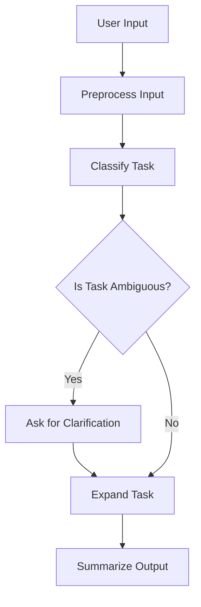

# 🧠 AI Task Assistant (LangGraph + Ollama LLaMA2)

A privacy-first, local AI-powered assistant that takes in user-defined tasks, classifies them, detects ambiguity, and breaks them down into clear, actionable steps using [LangGraph](https://github.com/langchain-ai/langgraph) and [Ollama](https://ollama.com) running [LLaMA2](https://ollama.com/library/llama2).

---

## 🚀 Features

- 🧾 **Natural Language Task Input**
- 🧠 **Category Classification (Work, Health, etc.)**
- 🔍 **Ambiguity Detection & Clarification**
- 🪄 **Task Expansion into Actionable Steps**
- 📦 Modular graph-based architecture using LangGraph
- 💻 100% offline execution via Ollama + LLaMA2

---

## 🧱 Project Structure

```
ai_task_assistant/
├── main.py           # Entry point (CLI interface)
├── graph.py          # LangGraph configuration
├── nodes/
│   ├── classify.py   # Task classification node
│   ├── clarify.py    # Clarification path (if ambiguous)
│   ├── expand.py     # Task expansion into steps
│   ├── preprocess.py # Input cleaning
│   └── summarize.py  # Final summary output
├── utils/
│   ├── llm.py        # LLaMA2 wrapper via LangChain + Ollama
│   └── storage.py    # (Optional) task persistence
└── README.md
```

---

## 🛠️ Installation

### 1. Install Python dependencies

```bash
pip install langchain langgraph ollama
```

### 2. Install & run Ollama

Install Ollama for your OS, then pull and run LLaMA 2:

```bash
ollama pull llama2
ollama run llama2
```

Ollama runs a local LLM server at http://localhost:11434.

---

## ▶️ Running the App

```bash
python main.py
```

**Example:**

```
📝 Enter a task (or 'q' to quit): Plan a birthday party for my daughter

✅ Final Output:
• Task: Plan a birthday party for my daughter
• Category: Personal
• Action Steps:
    1. Choose a date and time.
    2. Decide on a theme.
    3. Book a venue or plan at home.
    4. Make a guest list.
    5. Order food and cake.
    6. Send out invitations.
```

---

## 🔄 LangGraph Flow



---

## 📌 Why Use LangGraph?

LangGraph allows us to:

- Define reusable, testable task-processing nodes
- Branch execution paths (e.g., ambiguity handling)
- Cleanly extend the assistant with tools or memory

---

## 🧩 Future Enhancements

- 💾 Save tasks locally (JSON, SQLite)
- ⏰ Add deadlines and priorities
- 🌐 Convert to web app (Streamlit)
- 📚 Add memory using Chroma or FAISS
- 📈 Display task history or metrics

---

## 🤖 Powered By

- LangGraph
- Ollama
- LLaMA 2
- LangChain